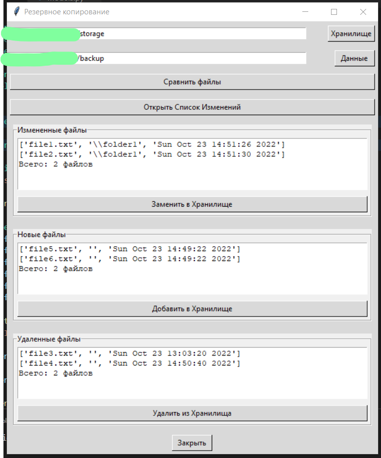
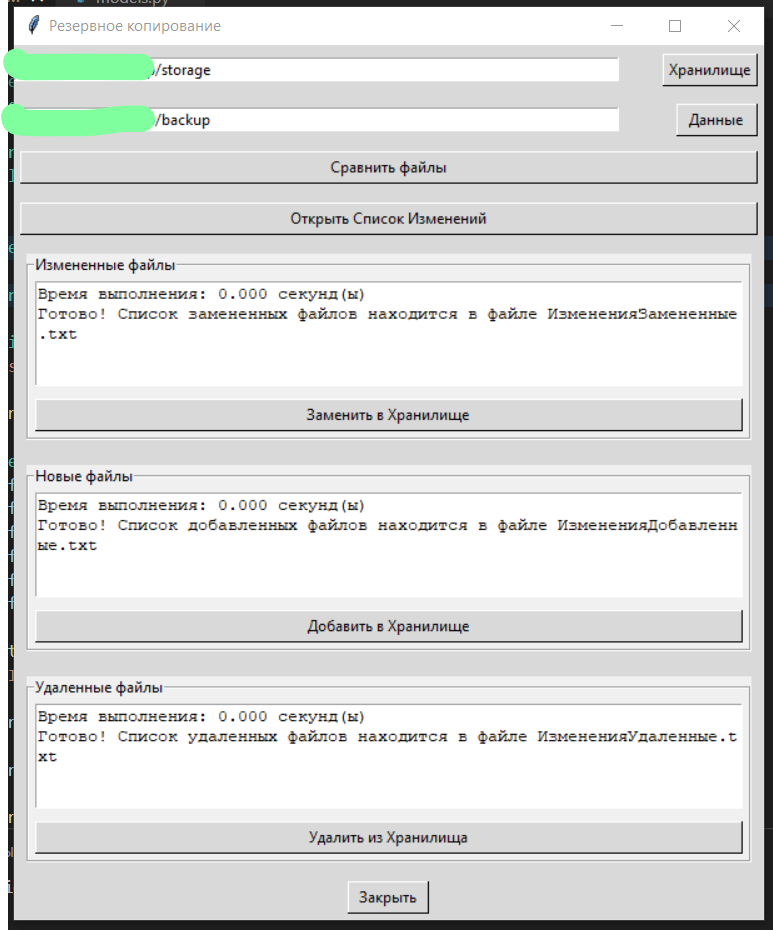

  

  

<h1>Backup application</h1>
It's a simple backup application, which compares files 
between destination and source folders and reflect 
changes from the source to the destination. 
Changes are such as adding new files, removing 
and modifying. 
 
Simple interface (RU language): 
 
<h3>Steps to make a backup:</h3> 
1. Browse for Data (that you want to backup) 
and Storage (where you want to put that data) 
by clicking Data and Storage buttons. 
2. Click the button to Compare current content 
of your Data and Storage folders. 
3. Click the button to see what will be changed. 
4. Click buttons to actually change the files 
in Storage folder. 
 
And it's done! 
 